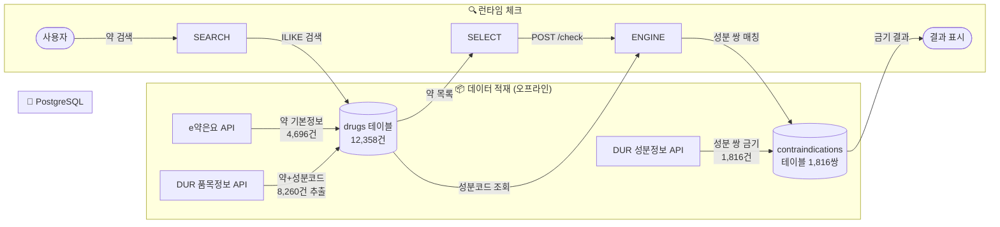
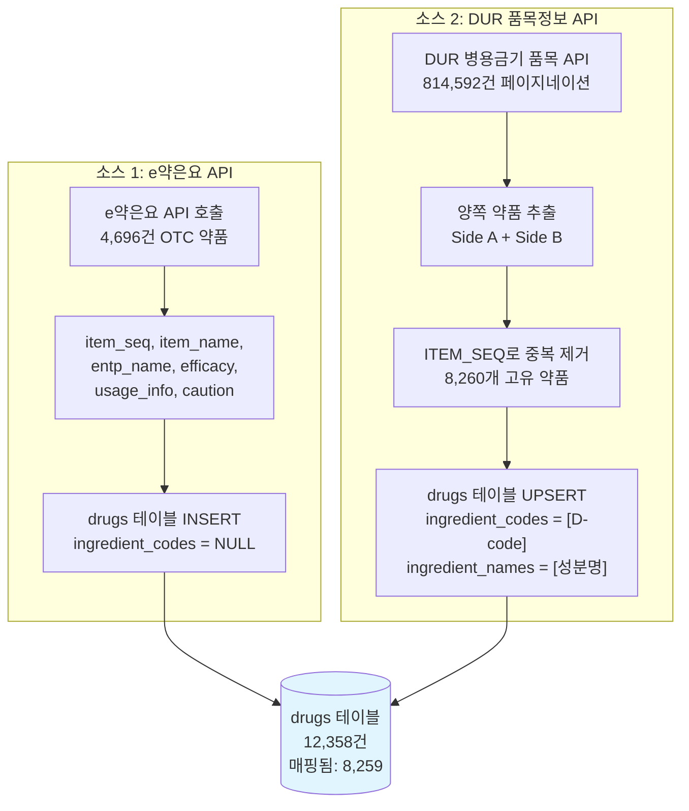
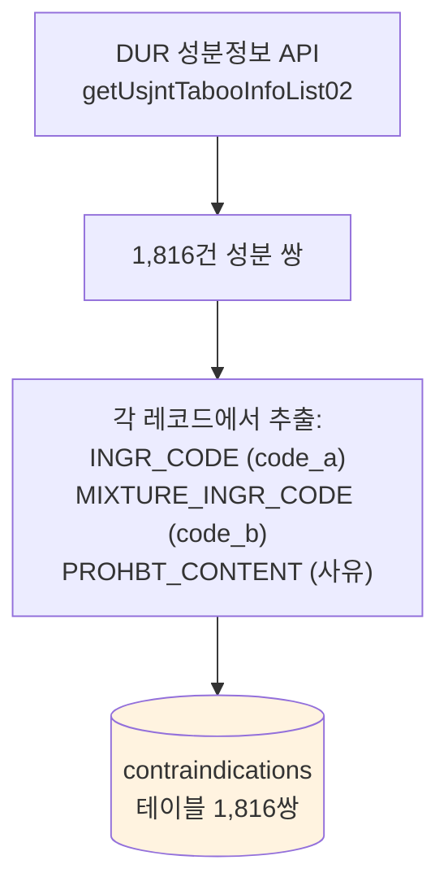

# yakcheck 데이터 흐름 다이어그램

> **Last updated**: 2026-04-08
> 약 병용금기 체크가 어떤 데이터를 조합하여 이루어지는지 시각화

---

## 1. 전체 구조 (데이터 적재 → 런타임 체크)



---

## 2. 핵심: 약 → 성분 → 금기 매칭 체인

약 병용금기 체크의 핵심은 **3단계 데이터 조합**입니다:

```
┌─────────────────────────────────────────────────────────────────┐
│                                                                 │
│   [약 이름]  ──→  [성분코드 D-code]  ──→  [금기 쌍 매칭]       │
│                                                                 │
│   drugs 테이블     drugs.ingredient_codes   contraindications   │
│   item_name        ingredient_codes[]       (code_a, code_b)   │
│                                                                 │
└─────────────────────────────────────────────────────────────────┘
```

### 구체적 예시

```
사용자가 선택한 약: 타이레놀정 + 코니트라캡슐

Step 1: 약 → 성분코드 조회 (drugs 테이블)
  ┌──────────────────┐      ┌─────────────────────┐
  │ 타이레놀정        │      │ 코니트라캡슐          │
  │ item_seq: 195900020│     │ item_seq: 200000913  │
  │ ingredient_codes: │      │ ingredient_codes:    │
  │   [D000020]       │      │   [D000762]          │
  │   (아세트아미노펜) │      │   (이트라코나졸)      │
  └────────┬─────────┘      └────────┬────────────┘
           │                          │
           ▼                          ▼
Step 2: 모든 성분 쌍 조합 생성
  ┌─────────────────────────────────────────┐
  │  (D000020, D000762)                     │
  │  = (아세트아미노펜, 이트라코나졸) 쌍     │
  └────────────────┬────────────────────────┘
                   │
                   ▼
Step 3: contraindications 테이블에서 매칭
  ┌─────────────────────────────────────────┐
  │  SELECT * FROM contraindications        │
  │  WHERE (code_a, code_b)                 │
  │     IN (('D000020','D000762'))           │
  │     OR (code_b, code_a)                 │
  │     IN (('D000020','D000762'))           │
  │                                         │
  │  → 매칭 있음 = ⚠️ 병용금기!             │
  │  → 매칭 없음 = ✅ 안전                   │
  └─────────────────────────────────────────┘
```

---

## 3. 약 3개 이상일 때: 교차 매칭

```
선택: 약A, 약B, 약C

Step 1: 각 약의 성분코드 조회
  약A → [D001, D002]     (성분 2개)
  약B → [D003]           (성분 1개)
  약C → [D004, D005]     (성분 2개)

Step 2: 약 "쌍"별 성분 조합 생성
  ┌─────────┬──────────────────────────────────────────┐
  │ 약 쌍    │ 성분 조합                                 │
  ├─────────┼──────────────────────────────────────────┤
  │ A ↔ B   │ (D001,D003), (D002,D003)                │
  │ A ↔ C   │ (D001,D004), (D001,D005),               │
  │         │ (D002,D004), (D002,D005)                 │
  │ B ↔ C   │ (D003,D004), (D003,D005)                │
  └─────────┴──────────────────────────────────────────┘
  총 8개 성분 쌍

Step 3: 한 번의 DB 쿼리로 모든 쌍 매칭
  WHERE (code_a, code_b) IN (8개 쌍)
     OR (code_b, code_a) IN (8개 쌍)

Step 4: 결과를 약 쌍 단위로 그룹핑
  ┌─────────────────────────────────────────────┐
  │ 🔴 약A ↔ 약B: D001-D003 병용금기 (위험)     │
  │ 🟡 약A ↔ 약C: D002-D004 주의 필요           │
  │ ✅ 약B ↔ 약C: 금기 없음                      │
  └─────────────────────────────────────────────┘
```

---

## 4. 데이터 적재 흐름 상세

### 4-1. drugs 테이블 채우기 (2개 소스)



### 4-2. contraindications 테이블 채우기



---

## 5. 핵심 식별자: D-code (DUR 성분코드)

**전체 시스템의 핵심 연결고리**는 `D-code` (DUR 성분코드)입니다:

```
┌─────────────────────────────────────────────────────────┐
│                     D-code 연결 맵                       │
│                                                         │
│  drugs.ingredient_codes[]  ←── D000762 ──→  contra.     │
│  (약이 어떤 성분 포함)                      code_a/code_b│
│                                            (어떤 성분끼리│
│                                             금기인지)    │
│                                                         │
│  ┌─────────┐    D000762     ┌──────────────────┐       │
│  │ 약 A     │──────┐        │ contraindications │       │
│  │ 약 B     │──┐   ├───────→│ D000762 ↔ D000020 │       │
│  │ 약 C     │  │   │        │ D000762 ↔ D000318 │       │
│  └─────────┘  │   │        │ ...                │       │
│               └───┘        └──────────────────┘       │
│                                                         │
│  약에서 D-code 추출 → 쌍 조합 → 금기 테이블 매칭        │
└─────────────────────────────────────────────────────────┘
```

---

## 6. API → DB 필드 매핑 요약

| DB 필드 | 소스 API | API 필드 |
|---------|---------|---------|
| `drugs.item_seq` | e약은요 / DUR 품목 | `ITEM_SEQ` |
| `drugs.item_name` | e약은요 / DUR 품목 | `ITEM_NAME` |
| `drugs.entp_name` | e약은요 / DUR 품목 | `ENTP_NAME` |
| `drugs.ingredient_codes` | DUR 품목 | `INGR_CODE` (D-code) |
| `drugs.ingredient_names` | DUR 품목 | `INGR_KOR_NAME` |
| `drugs.efficacy` | e약은요 | `efcyQesitm` |
| `drugs.usage_info` | e약은요 | `useMethodQesitm` |
| `drugs.caution` | e약은요 | `atpnQesitm` |
| `contra.ingredient_code_a` | DUR 성분 | `INGR_CODE` |
| `contra.ingredient_code_b` | DUR 성분 | `MIXTURE_INGR_CODE` |
| `contra.reason` | DUR 성분 | `PROHBT_CONTENT` |

---

## 7. 한눈에 보는 체크 플로우

```
╔══════════════════════════════════════════════════════════════╗
║                                                              ║
║   👤 사용자: "타이레놀 + 코니트라" 검색 후 선택               ║
║                          │                                   ║
║                          ▼                                   ║
║   ┌──────────────────────────────────────┐                  ║
║   │ POST /yakcheck/v1/check              │                  ║
║   │ body: { drugIds: ["195900020",       │                  ║
║   │                    "200000913"] }     │                  ║
║   └──────────────┬───────────────────────┘                  ║
║                  │                                           ║
║                  ▼                                           ║
║   ┌──────────────────────────────────────┐                  ║
║   │ 1️⃣  drugs에서 성분코드 조회            │                  ║
║   │    195900020 → [D000020]             │                  ║
║   │    200000913 → [D000762]             │                  ║
║   └──────────────┬───────────────────────┘                  ║
║                  │                                           ║
║                  ▼                                           ║
║   ┌──────────────────────────────────────┐                  ║
║   │ 2️⃣  성분 쌍 조합                       │                  ║
║   │    (D000020, D000762) — 1쌍           │                  ║
║   └──────────────┬───────────────────────┘                  ║
║                  │                                           ║
║                  ▼                                           ║
║   ┌──────────────────────────────────────┐                  ║
║   │ 3️⃣  contraindications 매칭            │                  ║
║   │    WHERE (code_a,code_b) IN (...)    │                  ║
║   │       OR (code_b,code_a) IN (...)    │                  ║
║   └──────────────┬───────────────────────┘                  ║
║                  │                                           ║
║                  ▼                                           ║
║   ┌──────────────────────────────────────┐                  ║
║   │ 4️⃣  결과 반환                          │                  ║
║   │    { pairs: [...], summary: {        │                  ║
║   │        danger: 1, caution: 0,        │                  ║
║   │        safe: 0 } }                   │                  ║
║   └──────────────────────────────────────┘                  ║
║                                                              ║
╚══════════════════════════════════════════════════════════════╝
```

---

*Related*: [api-data-sources.md](./api-data-sources.md) — 각 API의 상세 스펙
